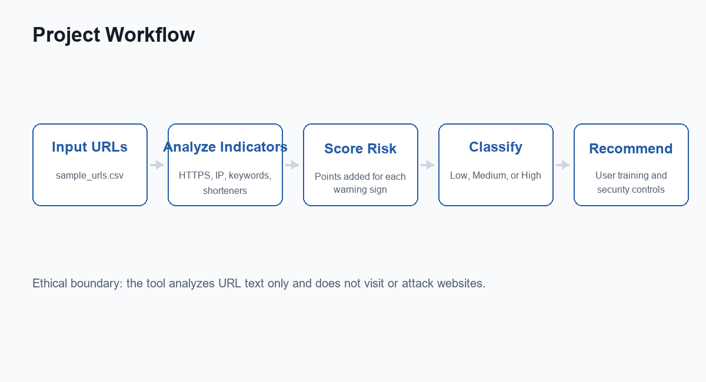
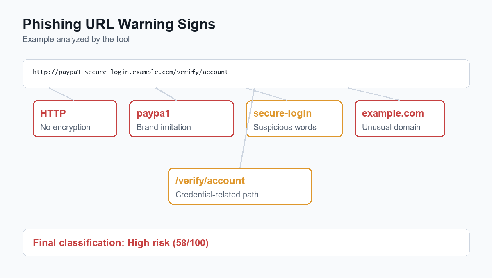
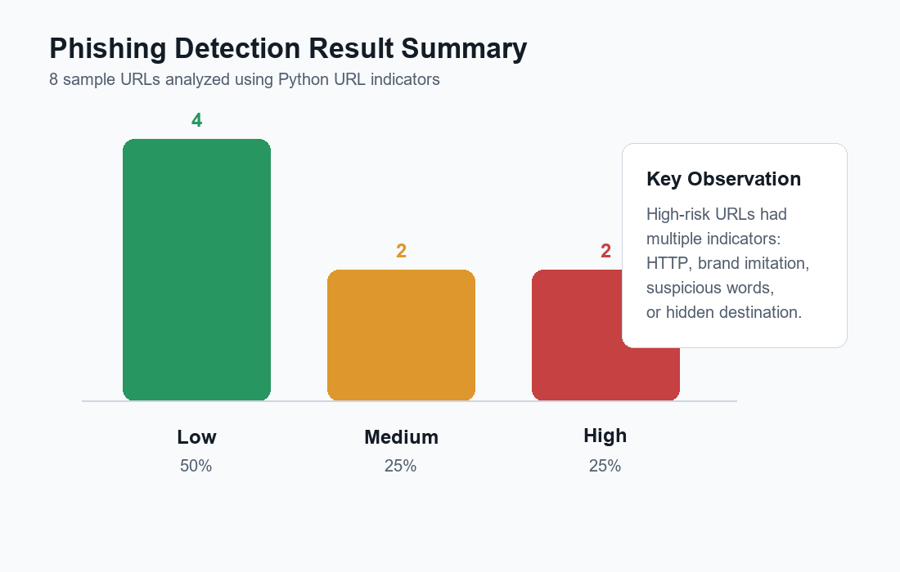
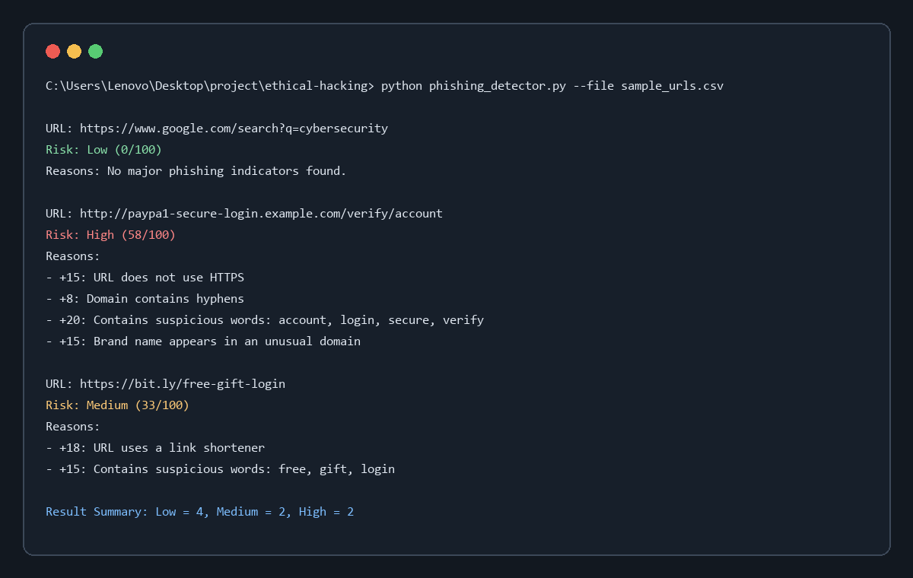

# Simulated Cybersecurity Scenario Report

## Title

Phishing Website Detection Challenge

## Aim

To identify phishing indicators in suspicious URLs using a safe, simulated cybersecurity activity and recommend countermeasures for users and organizations.

## Team Size

2 members

## Selected Task

Phishing Website Detection Challenge

This task was selected because it is medium difficulty and easy to implement in a classroom lab. It helps students understand a common real-world cyber threat without attacking any system or visiting unsafe websites.

## Scenario

A small organization wants to train its employees to identify phishing links before clicking them. The team is asked to analyze a list of sample URLs and classify them as low, medium, or high risk based on visible phishing indicators.

The activity is performed using a Python-based URL analysis tool. The tool does not open the websites. It only checks the structure and text of each URL.

## Tool Used

- Python 3
- Custom URL analysis script: `phishing_detector.py`
- Sample dataset: `sample_urls.csv`

## Project Workflow Diagram



## Methodology

1. Collected safe sample URLs for testing.
2. Studied common phishing indicators.
3. Created a Python script to analyze URL patterns.
4. Assigned risk points for suspicious indicators.
5. Classified URLs as Low, Medium, or High risk.
6. Prepared security recommendations based on the findings.

## Phishing Indicators Checked

| Indicator | Security Concern |
|---|---|
| HTTP instead of HTTPS | Data may not be encrypted |
| IP address as domain | Hides the actual identity of the website |
| Many subdomains | Can confuse users about the real domain |
| Link shortener | Hides the final destination |
| Suspicious words | Words like login, verify, update, prize, and password are common in phishing |
| Brand name in unusual domain | Attackers may imitate trusted brands |
| Long URL or encoded characters | May hide malicious destination details |
| @ symbol in URL | Can mislead users about the actual website |

## Phishing URL Warning Signs Diagram



## Sample Findings

| URL | Risk | Reason |
|---|---|---|
| `https://www.google.com/search?q=cybersecurity` | Low | No major phishing indicators |
| `https://www.paypal.com/signin` | Low | Recognized domain, only one sensitive keyword |
| `http://192.168.1.20/login` | Medium | Uses HTTP, IP address, and login keyword |
| `http://paypa1-secure-login.example.com/verify/account` | High | Uses HTTP, suspicious words, brand-like name, and multiple subdomains |
| `https://bit.ly/free-gift-login` | Medium | Uses link shortener and suspicious words |
| `http://microsoft-support-update.example.net/password-reset` | High | Uses HTTP, brand name in unusual domain, and suspicious words |
| `https://www.wikipedia.org/` | Low | No major phishing indicators |
| `https://accounts.google.com/` | Low | Recognized domain, only one sensitive keyword |

## Generated Results

The tool was executed using the command:

```bash
python phishing_detector.py --file sample_urls.csv
```

The generated classification was:

| Risk Level | Number of URLs | Percentage |
|---|---:|---:|
| Low | 4 | 50% |
| Medium | 2 | 25% |
| High | 2 | 25% |



## Demo Output Screenshot



## Detailed Result Analysis

The URLs classified as High risk had several suspicious indicators together. The URL `http://paypa1-secure-login.example.com/verify/account` looked like a fake PayPal-related login link. It used HTTP, contained words such as `secure`, `login`, `verify`, and `account`, and used a brand-like name in an unusual domain.

The URL `http://microsoft-support-update.example.net/password-reset` was also classified as High risk because it used HTTP, included a trusted brand name in a non-official domain, and contained words commonly found in phishing messages.

The Medium-risk URLs had clear warning signs but fewer indicators than the High-risk URLs. The IP-based login URL was suspicious because normal users usually expect readable domain names, not IP addresses. The shortened URL was suspicious because link shorteners hide the final destination.

The Low-risk URLs were mostly recognized domains with very few indicators. However, the tool still gave small scores to words such as `signin` and `account`, because these words can appear in both legitimate and phishing URLs.

## Screenshots / Evidence to Include

During submission, the following screenshots can be attached:

1. Python script opened in the editor.
2. `sample_urls.csv` showing the test URLs.
3. Terminal output after running `python phishing_detector.py --file sample_urls.csv`.
4. Generated results showing Low, Medium, and High risk examples.

## Discussion

This simulation shows that phishing detection depends on checking multiple clues together. A single keyword does not always mean a URL is dangerous. For example, a legitimate website may use words like `account` or `signin`. However, when suspicious words appear together with HTTP, brand imitation, link shorteners, or unusual domains, the risk becomes much higher.

The activity also shows why user awareness is important. Automated tools can support detection, but users must still verify links carefully before entering credentials.

## Threat Analysis

Phishing attacks trick users into trusting fake links. Attackers commonly create URLs that look similar to real services, use urgent language, and direct users to fake login pages. If users enter credentials on such pages, attackers can steal accounts, financial data, or personal information.

In this simulation, the highest-risk URLs had multiple warning signs, such as missing HTTPS, suspicious keywords, and brand names placed in unusual domains.

## Recommended Countermeasures

- Check the domain name carefully before entering credentials.
- Avoid clicking shortened links from unknown sources.
- Use multi-factor authentication.
- Train users to identify suspicious URLs and urgent messages.
- Use browser phishing protection and email security filters.
- Organizations should monitor lookalike domains.
- Use password managers because they usually do not autofill credentials on fake domains.
- Report suspected phishing links to the IT/security team.

## Limitations

- The tool analyzes only the URL text.
- It does not open websites or inspect page content.
- It does not check live threat intelligence databases.
- It cannot guarantee that a Low-risk URL is always safe.
- Some legitimate URLs may receive small risk scores because they contain common login-related words.

## Future Enhancements

- Add domain age checking.
- Add SSL certificate checking.
- Add email header analysis.
- Add machine learning classification.
- Add browser reputation or threat intelligence lookup.
- Export results automatically to CSV or PDF.

## Ethical and Legal Considerations

This activity was performed only with sample URLs in a controlled educational environment. The tool does not attack websites, steal information, or collect user credentials. Testing or scanning real websites without permission is illegal and unethical.

## Conclusion

The phishing website detection challenge helped demonstrate how attackers use deceptive URLs to trick users. The activity improved awareness of phishing indicators and showed how simple analysis can reduce risk. The recommended controls, especially user training, MFA, and careful URL verification, can help protect individuals and organizations from phishing attacks.
